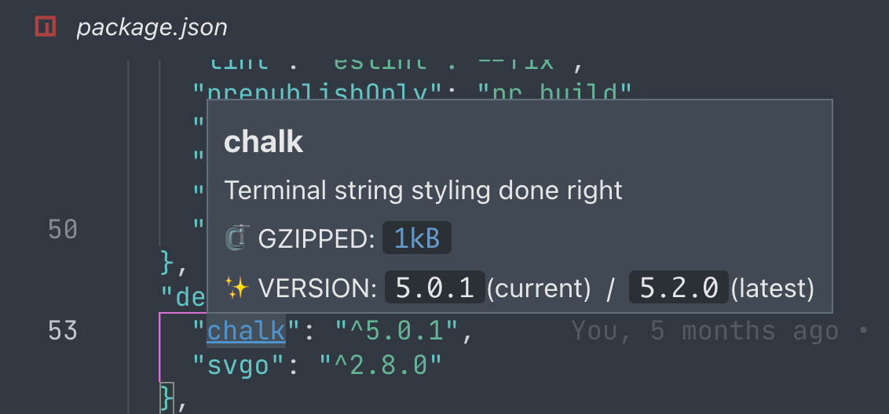
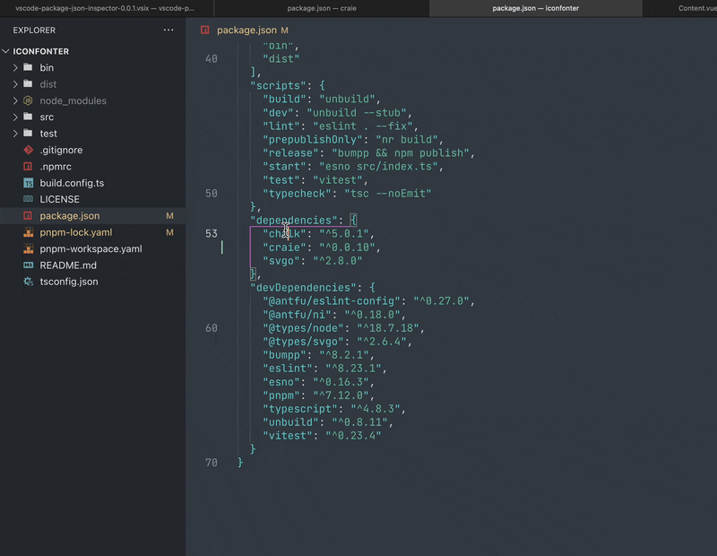

<h1 align="center">
  
  
Npm package.json Inspector for VS Code

</h1>

  

## Preview

### Hover to see metadata of package

  

- `title`: with a link if the `homepage` field is provided
- `description`: hidden if no description
- `GZipped size`: powered by [bundlephobia.com](https://bundlephobia.com), only for public npm packages
- `version`: currently using and the latest version

### **<kbd>cmd</kbd> + click** to goto node_modules

  

## Install

👉 Install it in the [marketplace of VS Code](https://marketplace.visualstudio.com/items?itemName=kricsleo.vscode-package-json-inspector)

## License

[MIT](./LICENSE) License © 2023 [Kricsleo](https://github.com/kricsleo)
